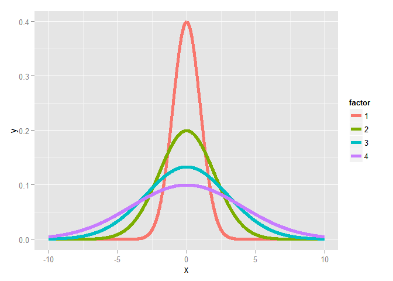
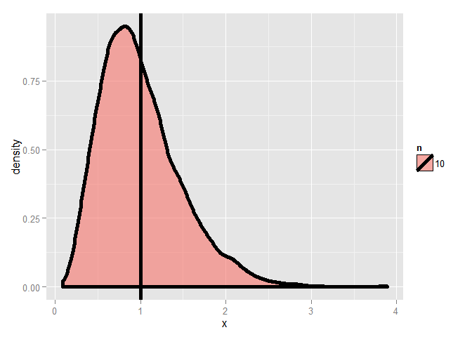
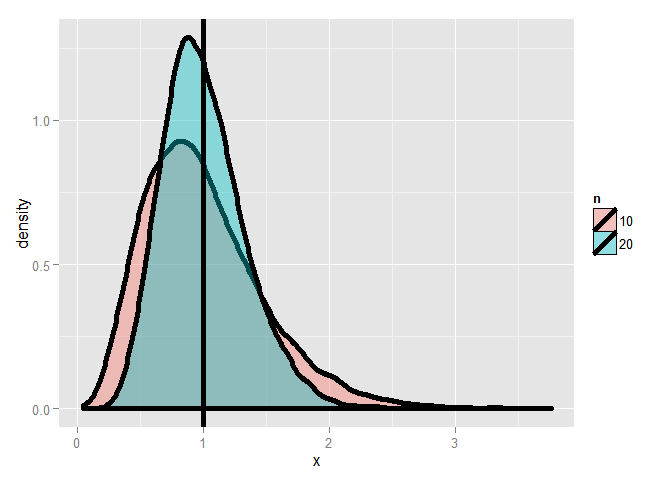
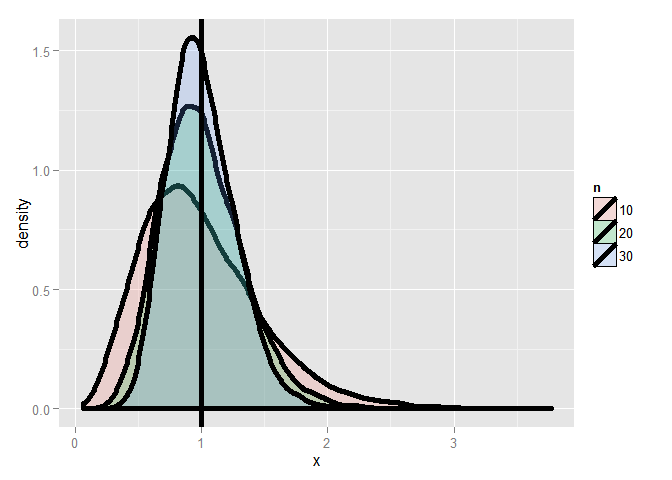

# Variance

[Source](https://github.com/swirldev/swirl_courses/tree/master/Statistical_Inference/Variance)


In this lesson, we'll discuss variances of distributions which, like means, are useful in characterizing them. While the mean characterizes the center of a distribution, the variance and its square root, the standard deviation, characterize the distribution's spread around the mean. As the sample mean estimates the population mean, so the sample variance estimates the population variance.

The variance of a random variable, as a measure of spread or dispersion, is, like a mean, defined as an expected value. It is the expected squared distance of the variable from its mean. Squaring the distance makes it positive so values less than and greater than the mean are treated the same. In mathematical terms, if X comes from a population with mean mu, then `Var(X) = E( (X-mu)^2 ) = E( (X-E(X))^2 ) = E(X^2)-E(X)^2`

So variance is the difference between two expected values. Recall that E(X), the expected value of a random variable from the population, is mu, the mean of that population. Higher variance implies more spread around a mean than lower variance.

Finally, it's easy to show from the definition and the linearity of expectations that, if a is a constant, then `Var(aX)=a^2*Var(X)`. This will come in handy later.

If you're interested, here's the proof. You might have to stretch out your plot window to make it clearer.


Let's practice computing the variance of a dice roll now. First we need to compute E(X^2). From the definition of expected values, this means we'll take a weighted sum over all possible values of X^2. The weight is the probability of X occurring.

For convenience, we've defined a 6-long vector for you, dice_sqr, which holds the squares of the integers 1 through 6. This will give us the X^2 values. Look at it now.


```r
dice_sqr
```

```
## [1]  1  4  9 16 25 36
```

Now we need weights. For these we can use any of the three PDF's, (dice_fair, dice_high, and dice_low) we defined in the previous lesson. Using R's ability to multiply vectors componentwise and its function 'sum' we can easily compute E(X^2) for any of these dice. Simply sum the product `dice_sqr * PDF`.  Try this now with dice_fair and put the result in a variable ex2_fair.


```r
ex2_fair <- sum(dice_fair * dice_sqr)
```

Recall that the expected value of a fair dice roll is 3.5. Subtract the square of that from ex2_fair to compute the sample variance.


```r
ex2_fair - 3.5^2
```

```
## [1] 2.916667
```

Now use a similar approach to compute the sample variance of dice_high in one step. Sum the appropriate product and subtract the square of the mean. Recall that edh holds the expected value of dice_high.


```r
sum(dice_high * dice_sqr) - edh^2
```

```
## [1] 2.222222
```

Note that when we talk about variance we're using square units. Because it is often more useful to use measurements in the same units as X we define the standard deviation of X as the square root of Var(X).

Here's a figure from the slides. It shows several normal distributions all centered around a common mean 0, but with different standard deviations. As you can see from the color key on the right, the thinner the bell the smaller the standard deviation and the bigger the standard deviation the fatter the bell.


```r
xvals <- seq(-10, 10, by = .01)
dat <- data.frame(
  y = c(
    dnorm(xvals, mean = 0, sd = 1),
    dnorm(xvals, mean = 0, sd = 2),
    dnorm(xvals, mean = 0, sd = 3),
    dnorm(xvals, mean = 0, sd = 4)
  ),
  x = rep(xvals, 4),
  factor = factor(rep(1 : 4, rep(length(xvals), 4)))
)
g <- ggplot(dat, aes(x = x, y = y, color = factor)) + geom_line(size = 2)    
print(g)
```

 

Just as we distinguished between a population mean and a sample mean we have to distinguish between a population variance sigma^2 and a sample variance s^2. They are defined similarly but with a slight difference. The sample variance is defined as the sum of n squared distances from the sample mean divided by (n-1), where n is the number of samples or observations. We divide by n-1 because this is the number of degrees of freedom in the system. The first n-1 samples or observations are independent given the mean. The last one isn't independent since it can be calculated from the sample mean used in the formula.

**In other words, the sample variance is ALMOST the average squared deviation from the sample mean.**

As with the sample mean, the sample variance is also a random variable with an associated population distribution. Its expected value or mean is the population variance and its distribution gets more concentrated around the population variance with more data. The sample standard deviation is the square root of the sample variance.

To illustrate this point, consider this figure which plots the distribution of 10000 variances, Each variance was computed on a sample of standard normals of size 10. The vertical line indicates the standard deviation 1.


```r
nosim <- 10000; 
dat <- data.frame(
  x = c(apply(matrix(rnorm(nosim * 10), nosim), 1, var)),
  n = factor(rep(c("10"), c(nosim))) 
)
g <- ggplot(dat, aes(x = x, fill = n)) + geom_density(size = 2, alpha = .6) + geom_vline(xintercept = 1, size = 2) 
print(g)
```

 

Here we do the same experiment but this time (the taller lump) each of the 10000 variances is over 20 standard normal samples. We've plotted over the first plot (the shorter lump) and you can see that the distribution of the variances is getting tighter and shifting closer to the vertical line.


```r
dat <- data.frame(
  x = c(apply(matrix(rnorm(nosim * 10), nosim), 1, var),
        apply(matrix(rnorm(nosim * 20), nosim), 1, var)),
  n = factor(rep(c("10", "20"), c(nosim, nosim))) 
)
g <- ggplot(dat, aes(x = x, fill = n)) + geom_density(size = 2, alpha = .4) + geom_vline(xintercept = 1, size = 2) 
print(g)
```

 

Finally, we repeat the experiment using 30 samples for each of the 10000 variances. You can see that with more data, the distribution gets more concentrated around the population variance it is trying to estimate.


```r
dat <- data.frame(
  x = c(apply(matrix(rnorm(nosim * 10), nosim), 1, var),
        apply(matrix(rnorm(nosim * 20), nosim), 1, var),
        apply(matrix(rnorm(nosim * 30), nosim), 1, var)),
  n = factor(rep(c("10", "20", "30"), c(nosim, nosim, nosim))) 
)
g <- ggplot(dat, aes(x = x, fill = n)) + geom_density(size = 2, alpha = .2) + geom_vline(xintercept = 1, size = 2) 
print(g)
```

 

Now recall that the means of unbiased estimators equal the values they're trying to estimate. We can infer from the above that the sample variance is an unbiased estimator of population variance.

Recall that the average of random samples from a population is itself a random variable with a distribution centered around the population mean. Specifically, E(X') = mu, where X' represents a sample mean and mu is the population mean.

We can show that, if the population is infinite, the variance of the sample mean is the population variance divided by the sample size. Specifically, Var(X') = sigma^2 / n. Let's work through this in four short steps.

Which of the following does Var(X') equal? Here X' represents the sample mean and 'Sum(X_i)' represents the sum of the n samples X_1,...X_n. Assume these samples are independent.

* 1: mu
* 2: sigma
* `3: Var(1/n * Sum(X_i))`
* 4: E(1/n * Sum(X_i))

Which of the following does Var(1/n * Sum(X_i)') equal?

* 1: 1/n^2*E(Sum(X_i))
* `2: 1/n^2*Var(Sum(X_i))`
* 3: mu/n^2
* 4: sigma/n

Recall that Var is an expected value and expected values are linear. Also recall that our samples X_1, X_2,...,X_n are independent. What does Var(Sum(X_i)) equal?

* 1: Var(sigma)
* `2: Sum(Var(X_i))`
* 3: E(Sum(X_i))
* 4: E(mu)

Finally, each X_i comes from a population with variance sigma^2. What does Sum(Var(X_i)) equal? As before, Sum is taken over n values.

* 1: (n^2)*Var(sigma)
* 2: n*mu
* `3: n*(sigma)^2`
* 4: n*E(mu)

So we've shown that `Var(X')=Var(1/n*Sum(X_i))=(1/n^2)*Var(Sum(X_i))=(1/n^2)*Sum(sigm^2)=sigma^2/n` for infinite populations when our samples are independent.

The standard deviation of a statistic is called its standard error, so the standard error of the sample mean is the square root of its variance.

We just showed that the variance of a sample mean is sigma^2 / n and we estimate it with s^2 / n. It follows that its square root, s / sqrt(n), is the standard error of the sample mean.

The sample standard deviation, s, tells us how variable the population is, and s/sqrt(n), the standard error, tells us how much averages of random samples of size n from the population vary. Let's see this with some simulations.

The R function rnorm(n,mean,sd) generates n independent (hence uncorrelated) random normal samples with the specified mean and standard deviation. The defaults for the latter are mean 0 and standard deviation 1. Type the expression `sd(apply(matrix(rnorm(10000),1000),1,mean))` at the prompt.


```r
sd(apply(matrix(rnorm(10000),1000),1,mean))
```

```
## [1] 0.3091737
```

This returns the standard deviation of 1000 averages, each of a sample of 10 random normal numbers with mean 0 and standard deviation 1. The theory tells us that the standard error, s/sqrt(n), of the sample means indicates how much averages of random samples of size n (in this case 10) vary. Now compute 1/sqrt(10) to see if it matches the standard deviation we just computed with our simulation.


```r
1/sqrt(10)
```

```
## [1] 0.3162278
```

Pretty close, right? Let's try a few more. Standard uniform distributions have variance 1/12. The theory tells us the standard error of means of independent samples of size n would have which standard error?

* `1: 1/sqrt(12*n)`
* 2: I haven't a clue
* 3: 1/(12*sqrt(n))
* 4: 12/sqrt(n)

Compute 1/sqrt(120). This would be the standard error of the means of uniform samples of size 10.


```r
1/sqrt(120)
```

```
## [1] 0.09128709
```

Now check it as we did before. Use the expression sd(apply(matrix(runif(10000),1000),1,mean))


```r
sd(apply(matrix(runif(10000),1000),1,mean))
```

```
## [1] 0.09351395
```

Pretty close again, right? Poisson(4) are distributions with variance 4; what standard error would means of random samples of n Poisson(4) have?

* `1: 2/sqrt(n)`
* 2: I haven't a clue
* 3: 2*sqrt(n)
* 4: 1/sqrt(2*n)

We'll do another simulation to test the theory. First, assume you're taking averages of 10 Poisson(4) samples and compute the standard error of these means. Use the formula you just chose.


```r
2/sqrt(10)
```

```
## [1] 0.6324555
```

Now check it as we did before. Use the expression sd(apply(matrix(rpois(10000,4),1000),1,mean)).


```r
sd(apply(matrix(rpois(10000,4),1000),1,mean))
```

```
## [1] 0.6199003
```

Like magic, right? One final test. Fair coin flips have variance 0.25; means of random samples of n coin flips have what standard error?

* 1: I haven't a clue
* 2: 2/sqrt(n)
* 3: 2*sqrt(n)
* 4: 1/sqrt(2*n)
* `5: 1/(2*sqrt(n))`


You know the drill. Assume you're taking averages of 10 coin flips and compute the standard error of these means with the theoretical formula you just picked.


```r
1/(2 * sqrt(10))
```

```
## [1] 0.1581139
```

Now check it as we did before. Use the expression sd(apply(matrix(sample(0:1,10000,TRUE),1000),1,mean)).


```r
sd(apply(matrix(sample(0:1,10000,TRUE),1000),1,mean))
```

```
## [1] 0.1560049
```

Finally, here's something interesting. Chebyshev's inequality helps interpret variances. It states that the probability that a random variable X is at least k standard deviations from its mean is less than 1/(k^2). In other words, the probability that X is at least 2 standard deviations from the mean is less than 1/4, 3 standard deviations 1/9, 4 standard deviations 1/16, etc.

However this estimate is quite conservative for random variables that are normally distributed, that is, with bell-curve distributions. In these cases, the probability of being at least 2 standard deviations from the mean is about 5% (as compared to Chebyshev's upper bound of 25%) and the probability of being at least 3 standard deviations from the mean is roughly .2%.

Suppose you had a measurement that was 4 standard deviations from the distribution's mean. What would be the upper bound of the probability of this happening using Chebyshev's inequality?

* 1: 96%
* 2: 25%
* `3: 6%`
* 4: 11%
* 5: 0%

Now to review. The sample variance estimates what?

* 1: population
* 2: sample standard deviation
* 3: sample mean
* `4: population variance`

True or False - The sample variance gets more concentrated around the population variance with larger sample sizes

* 1: False
* `2: True`

The variance of the sample mean is the population variance divided by ?

* 1: I haven't a clue
* 2: n^2
* 3: sqrt(n)
* `4: n`

The standard error of the sample mean is the sample standard deviation s divided by ?

* 1: n^2
* 2: n
* 3: I haven't a clue
* `4: sqrt(n)`
