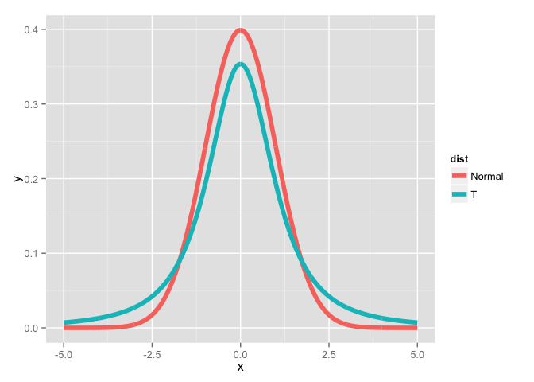
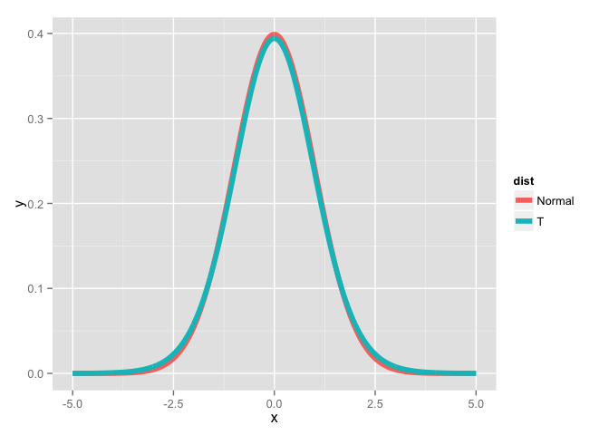
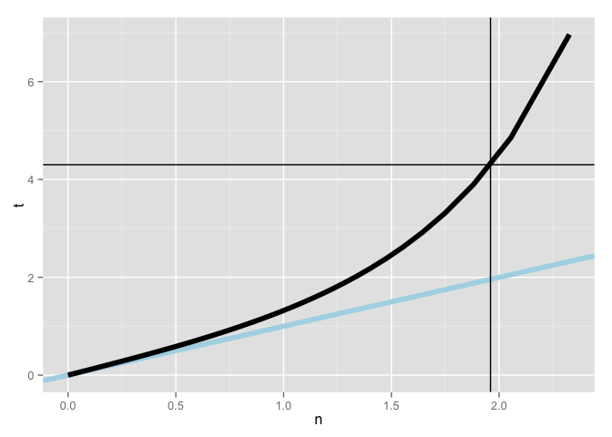
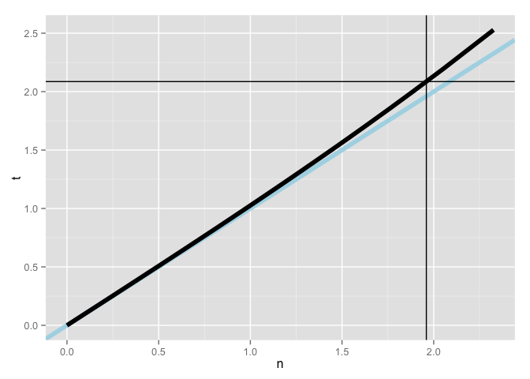
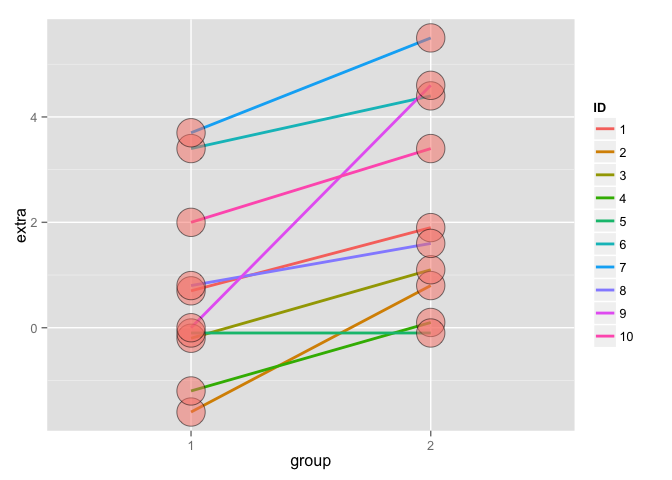

# T Confidence Intervals

[Source](https://github.com/swirldev/swirl_courses/tree/master/Statistical_Inference/T_Confidence_Intervals)


In this lesson, we'll discuss some statistical methods for dealing with small datasets, specifically the Student's or Gosset's t distribution and t confidence intervals.

In the Asymptotics lesson we discussed confidence intervals using the Central Limit Theorem (CLT) and normal distributions. These needed large sample sizes, and the formula for computing the confidence interval was Est +/- qnorm *std error(Est), where Est was some estimated value (such as a sample mean) with a standard error. Here qnorm represented what?

```
a specified quantile from a normal distribution
```

In the Asymptotics lesson we also mentioned the Z statistic Z=(X'-mu)/(sigma/sqrt(n)) which follows a standard normal distribution. This normalized statistic Z is especially nice because we know its mean and variance. They are what, respectively?

```
0 and 1
```

So the mean and variance of the standardized normal are fixed and known. Now we'll define the t statistic which looks a lot like the Z. It's defined as t=(X'-mu)/(s/sqrt(n)). Like the Z statistic, the t is centered around 0. The only difference between the two is that the population std deviation, sigma, in Z is replaced by the sample standard deviation in the t. So **the distribution of the t statistic is independent of the population mean and variance. Instead it depends on the sample size n**.

As a result, for t distributions, the formula for computing a confidence interval is similar to what we did in the last lesson. However, instead of a quantile for a normal distribution we use a quantile for a t distribution. So the formula is `Est +/- t-quantile *std error(Est)`. The other distinction, which we mentioned before, is that we'll use the sample standard deviation when we estimate the standard error of Est.

In the formula for the t statistic `t=(X'-mu)/(s/sqrt(n))` what expression represents the sample standard deviation?

```
s
```

These t confidence intervals are very handy, and if you have a choice between these and normal, pick these. We'll see that as datasets get larger, t-intervals look normal. We'll cover the one- and two-group versions which depend on the data you have.

**The t distribution, invented by William Gosset in 1908, has thicker tails than the normal. Also, instead of having two parameters, mean and variance, as the normal does, the t distribution has only one - the number of degrees of freedom (df).**

As df increases, the t distribution gets more like a standard normal, so it's centered around 0. Also, the t assumes that the underlying data are iid Gaussian so the statistic `(X' - mu)/(s/sqrt(n))` has n-1 degrees of freedom.

Quick check. In the formula `t=(X' - mu}/(s/sqrt(n))`, if we replaced s by sigma the statistic t would be what asymptotically?.

```
the standard normal
```

To see what we mean, we've taken code from the slides, the function myplot, which takes the integer df as its input and plots the t distribution with df degrees of freedom. It also plots a standard normal distribution so you can see how they relate to one another.

To see what we mean, we've taken code from the slides, the function myplot, which takes the integer df as its input and plots the t distribution with df degrees of freedom. It also plots a standard normal distribution so you can see how they relate to one another.


```r
k <- 1000
xvals <- seq(-5, 5, length = k)
myplot <- function(df){
  d <- data.frame(y = c(dnorm(xvals), dt(xvals, df)),
                  x = xvals,
                  dist = factor(rep(c("Normal", "T"), c(k,k))))
  g <- ggplot(d, aes(x = x, y = y)) 
  g <- g + geom_line(size = 2, aes(colour = dist))
  print(g)
}
```

Try myplot now with an input of 2.


```r
myplot(2)
```

 

You can see that the hump of t distribution (in blue) is not as high as the normal's. Consequently, the two tails of the t distribution absorb the extra mass, so they're thicker than the normal's. Note that with 2 degrees of freedom, you only have 3 data points. Ha! Talk about small sample sizes. Now try myplot with an input of 20.


```r
myplot(20)
```

 

The two distributions are almost right on top of each other using this higher degree of freedom.

Another way to look at these distributions is to plot their quantiles. From the slides, we've provided a second function for you, myplot2, which does this. It plots a lightblue reference line representing normal quantiles and a black line for the t quantiles. Both plot the quantiles starting at the 50th percentile which is 0 (since the distributions are symmetric about 0) and go to the 99th.


```r
pvals <- seq(.5, .99, by = .01)
myplot2 <- function(df){
  d <- data.frame(n= qnorm(pvals),t=qt(pvals, df),
                  p = pvals)
  g <- ggplot(d, aes(x= n, y = t))
  g <- g + geom_abline(size = 2, col = "lightblue")
  g <- g + geom_line(size = 2, col = "black")
  g <- g + geom_vline(xintercept = qnorm(0.975))
  g <- g + geom_hline(yintercept = qt(0.975, df))
  print(g)
}
```

Try myplot2 now with an argument of 2.


```r
myplot2(2)
```

 

The distance between the two thick lines represents the difference in sizes between the quantiles and hence the two sets of intervals. Note the thin horizontal and vertical lines. These represent the .975 quantiles for the t and normal distributions respectively. Anyway, you probably recognized the placement of the vertical at 1.96 from the Asymptotics lesson.


Check the placement of the horizontal now using the R function qt with the arguments .975 for the quantile and 2 for the degrees of freedom (df).


```r
qt(.975, df = 2)
```

```
## [1] 4.302653
```

See? It matches the horizontal line of the plot. Now run myplot2 with an argument of 20.


```r
myplot2(20)
```

 

The quantiles are much closer together with the higher degrees of freedom. At the 97.5 percentile, though, the t quantile is still greater than the normal. Student's Rules!

This means the the t interval is always wider than the normal. This is because estimating the standard deviation introduces more uncertainty so a wider interval results.

So the t-interval is defined as `X' +/- t_(n-1)*s/sqrt(n)` where t_(n-1) is the relevant quantile. The t interval assumes that the data are iid normal, though it is robust to this assumption and works well whenever the distribution of the data is roughly symmetric and mound shaped.

Our plots showed us that for large degrees of freedom, t quantiles become close to what?

```
standard normal quantiles
```

Although it's pretty great, the t interval isn't always applicable. For skewed distributions, the spirit of the t interval assumptions (being centered around 0) are violated. There are ways of working around this problem (such as taking logs or using a different summary like the median).

For highly discrete data, like binary, intervals other than the t are available.

However, paired observations are often analyzed using the t interval by taking differences between the observations. We'll show you what we mean now.

We hope you're not tired because we're going to look at some sleep data. This was the data originally analyzed in Gosset's Biometrika paper, which shows the increase in hours for 10 patients on two soporific drugs.

We've loaded the data for you. R treats it as two groups rather than paired. To see what we mean type sleep now. This will show you how the data is stored.


```r
sleep
```

```
##    extra group ID
## 1    0.7     1  1
## 2   -1.6     1  2
## 3   -0.2     1  3
## 4   -1.2     1  4
## 5   -0.1     1  5
## 6    3.4     1  6
## 7    3.7     1  7
## 8    0.8     1  8
## 9    0.0     1  9
## 10   2.0     1 10
## 11   1.9     2  1
## 12   0.8     2  2
## 13   1.1     2  3
## 14   0.1     2  4
## 15  -0.1     2  5
## 16   4.4     2  6
## 17   5.5     2  7
## 18   1.6     2  8
## 19   4.6     2  9
## 20   3.4     2 10
```

We see 20 entries, the first 10 show the results (extra) of the first drug (group 1) on each of the patients (ID), and the last 10 entries the results of the second drug (group 2) on each patient (ID).

Here we've plotted the data in a paired way, connecting each patient's two results with a line, group 1 results on the left and group 2 on the right. See that purple line with the steep slope? That's ID 9, with 0 result for group 1 and 4.6 for group 2.


```r
g <- ggplot(sleep, aes(x = group, y = extra, group = factor(ID)))
g <- g + geom_line(size = 1, aes(colour = ID)) + geom_point(size =10, pch = 21, fill = "salmon", alpha = .5)
print(g)
```

 

If we just looked at the 20 data points we'd be comparing group 1 variations with group 2 variations. Both groups have quite large ranges. However, when we look at the data paired for each patient, we see that the variations in results are usually much smaller and depend on the particular subject.
