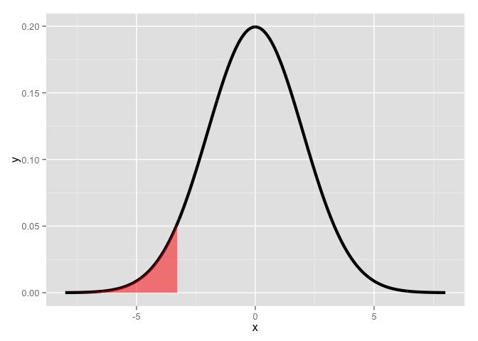
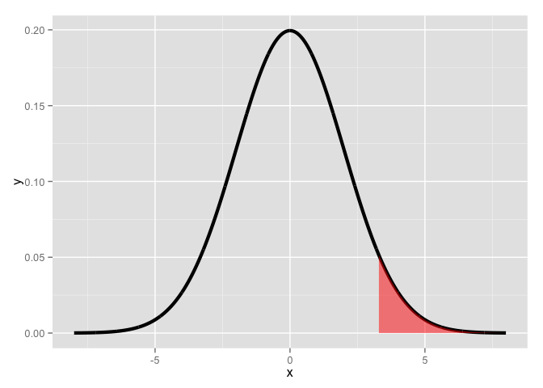
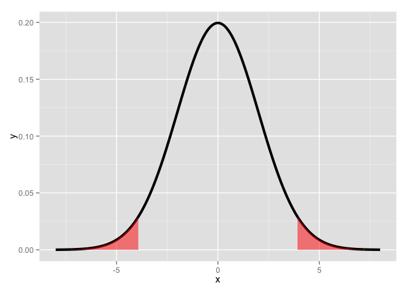

# Hypothesis Testing

[Source](https://github.com/swirldev/swirl_courses/tree/master/Statistical_Inference/Hypothesis_Testing)


In this lesson, as the name suggests, we'll discuss hypothesis testing which is concerned with making decisions about populations using observed data.

An important concept in hypothesis testing is the NULL hypothesis, usually denoted as H_0. **This is the hypothesis that represents the status_quo and is assumed true**. It's a baseline against which you're testing alternative hypotheses, usually denoted by H_a. Statistical evidence is required to reject H_0 in favor of the research or alternative hypothesis.

We'll consider the motivating example from the slides. A respiratory disturbance index (RDI) of more than 30 events / hour is considered evidence of severe sleep disordered breathing (SDB). Suppose that in a sample of 100 overweight subjects with other risk factors for (SDB) at a sleep clinic, the mean RDI (X') was 32 events / hour with a standard deviation (s) of 10 events / hour.

We want to test the null hypothesis H_0 that mu = 30. Our alternative hypothesis H_a is mu>30. Here mu represents the hypothesized population mean RDI.

So we have two competing hypotheses, H_0 and H_a, of which we'll have to pick one (using statistical evidence). That means we have four possible outcomes determined by what really is (the truth) and which hypothesis we accept based on our data. Two of the outcomes are correct and two are errors.

Which of the following outcomes would be correct?

```
H_a is TRUE and we accept it
```

Which of the following outcomes would be an error?

```
H_0 is TRUE and we reject it
```

So it's correct to accept a true hypothesis or reject a false one. Pretty clear, right? The errors are also clear - rejecting a true hypothesis or accepting a false one.

We distinguish between these two errors. A Type I error REJECTS a TRUE null hypothesis H_0 and a Type II error ACCEPTS a FALSE null hypothesis H_0.

Can we ever be sure that we're absolutely right?

```
No
```

Since there's some element of uncertainty in questions concerning populations, we deal with probabilities. In our hypothesis testing we'll set the probability of making errors small. For now we'll focus on Type I errors, rejecting a correct hypothesis.

The probabilities of making these two kinds of errors are related. If you decrease the probability of making a Type I error (rejecting a true hypothesis), you increase the probability of making a Type II error (accepting a false one) and vice versa.

As in the slides, we'll consider an American court of law. The null hypothesis is that the defendant is innocent. If an innocent man is convicted what type of error is this?

```
Type I
```

You might send the innocent man to jail by rejecting H_0. Suppose a guilty person is not convicted. What type of error is this?

```
Type II
```

Back to sleep (example)! A reasonable strategy would reject the null hypothesis if our sample mean X' was larger than some constant C. We choose C so that the probability of a Type I error, alpha, is .05 (or some other favorite constant). Many scientific papers use .05 as a standard level of rejection.

This means that alpha, the Type I error rate, is the probability of rejecting the null hypothesis when, in fact, it is correct. We don't want alpha too low because then we would never reject the null hypothesis even if it's false.

Recall that the standard error of a sample mean is given by the formula s/sqrt(n). Recall in our sleep example we had a sample of 100 subjects, our mean RDI (X') was 32 events / hour with a standard deviation (s) of 10 events / hour. What is the standard error of the mean in this example?


```r
10 / sqrt(100)
```

```
## [1] 1
```

Under H_0, X' is normally distributed with mean mu=30 and variance 1. (We're estimating the variance as the square of the standard error which in this case is 1.) We want to choose the constant C so that the probability that X is greater than C given H_0 is 5%. That is, P(X > C| H_0) is 5%. Sound familiar?

Here's a plot to show what we mean. The shaded portion represents 5% of the area under the curve and those X values in it are those for which the probability that X>C is 5%.


```r
x <- seq(-8,8, length = 2000)
dat <- data.frame(x=x, y=dnorm(x,sd=2))
g <- ggplot(dat, aes(x = x, y = y)) + geom_line(size = 1.5)+scale_y_continuous(limits=c(0,max(dat$y)))
suppressWarnings(g <- g+ layer("area",mapping = aes(x=ifelse(x>qnorm(.95,sd=2),x,NA)),
            geom_params=list(fill="red",alpha=.5)) )
suppressWarnings(print(g))
```

 

The shaded portion represents 5% of the area under this normal density curve. Which expression represents the smallest value X for which the area is shaded, assuming this is standard normal (which it really isn't)?

```
qnorm(.95)
```

The 95th percentile of a standard normal distribution is 1.645 standard deviations from the mean, so in our example we have to set C to be 1.645 standard deviations MORE than our hypothesized mean of 30, that is, C = 30 + 1.645 * 1 = 31.645 (recall that the variance and standard deviation equalled 1).

This means that if our OBSERVED (sample) mean X' >= C, then it's only a 5% chance that a random draw from this N(30,1) distribution is larger than C.

Recall that our observed mean X' is 32 which is greater than C=31.645, so it falls in that 5% region. What do we do with H_0?

```
reject it
```

So the rule "Reject H_0 when the sample mean X' >= 31.645" has the property that the probability of rejecting H_0 when it is TRUE is 5% given the model of this example - hypothesized mean mu=30, variance=1 and n=100.

Instead of computing a constant C as a cutpoint for accepting or rejecting the null hypothesis, we can simply compute a Z score, the number of standard deviations the sample mean is from the hypothesized mean. We can then compare it to quantile determined by alpha.

How do we do this? Compute the distance between the two means (32-30) and divide by the standard error of the mean, that is (s/sqrt(n)).

What is the Z score for this example? Recall the Z score is X'-mu divided by the standard error of the mean. In this example X'=32, mu=30 and the standard error is 10/sqrt(100)=1.


```r
32-30/1
```

```
## [1] 2
```

The Z score is 2. The quantile is 1.645, so since 2>1.645. What do we do with H_0?

```
reject it
```

**The general rule for rejection is if ```sqrt(n) * ( X' - mu) / s > Z_{1-alpha}```.**

Our test statistic is (X'-mu) / s/sqrt(n) which is standard normal.

This means that our test statistic has what mean and standard deviation?

```
0 and 1
```

Let's review and expand. Our null hypothesis is that the population mean mu equals the value mu_0 and alpha=.05. (This is the probability that we reject H_0 if it's true.) We can have several different alternative hypotheses.

Suppose our first alternative, H_a, is that mu < mu_0. We would reject H_0 (and accept H_a) when our observed sample mean is significantly less than mu_0. That is, our test statistic (X'-mu) / s/sqrt(n) is less than Z_alpha. Specifically, it is more than 1.64 standard deviations to the left of the mean mu_0.

Here's a plot to show what we mean. The shaded portion represents 5% of the area under the curve and those X values in it are those which are at least 1.64 standard deviations less than the mean. The probability of this is 5%. This means that if our sample mean fell in this area, we would reject a true null hypothesis, mu=mu_0, with probability 5%.


```r
x <- seq(-8,8, length = 1000)
dat <- data.frame(x=x, y=dnorm(x,sd=2))
g <- ggplot(dat, aes(x = x, y = y)) + geom_line(size = 1.5) + scale_y_continuous(limits=c(0.0,max(dat$y)))
suppressWarnings(g <- g+ layer("area",mapping = aes(x=ifelse(-9<x & x<qnorm(.05,sd=2),x,NA)),
            geom_params=list(fill="red",alpha=.5)) )
suppressWarnings(print(g))
```

 

We already covered the alternative hypothesis H_a that mu > mu_0 but let's review it. We would reject H_0 (and accept H_a) when our sample mean is what?

```
significantly greater than mu_0
```

This means that our test statistic (X'-mu) / s/sqrt(n) is what?

```
at least 1.64 std dev greater than mu_0
```

Here again is the plot to show this. The shaded portion represents 5% of the area under the curve and those X values in it are those which are at least 1.64 standard deviations greater than the mean. The probability of this is 5%. This means that if our observed mean fell in this area we would reject a true null hypothesis, that mu=mu_0, with probability 5%.


```r
x <- seq(-8,8, length = 2000)
dat <- data.frame(x=x, y=dnorm(x,sd=2))
g <- ggplot(dat, aes(x = x, y = y)) + geom_line(size = 1.5)+scale_y_continuous(limits=c(0,max(dat$y)))
suppressWarnings(g <- g+ layer("area",mapping = aes(x=ifelse(x>qnorm(.95,sd=2),x,NA)),
            geom_params=list(fill="red",alpha=.5)) )
suppressWarnings(print(g))
```

 

Since we want to stick with a 5% rejection rate, we divide it in half and consider values at both tails, at the .025 and the .975 percentiles.  This means that our test statistic (X'-mu) / s/sqrt(n) is less than .025, Z_(alpha/2), or greater than .975, Z_(1-alpha/2).

Here's the plot. As before, the shaded portion represents the 5% of the area composing the region of rejection. This time, though, it's composed of two equal pieces, each containing 2.5% of the area under the curve. The X values in the shaded portions are values which are at least 1.96 standard deviations away from the hypothesized mean.


```r
x <- seq(-8,8, length = 2000)
dat <- data.frame(x=x, y=dnorm(x,sd=2))
library(ggplot2)
g <- ggplot(dat, aes(x = x, y = y)) + geom_line(size = 1.5)+scale_y_continuous(limits=c(0,max(dat$y)))
suppressWarnings(g <- g+ layer("area",mapping = aes(x=ifelse(x>qnorm(.975,sd=2),x,NA)),
            geom_params=list(fill="red",alpha=.5)) +
   layer("area",mapping = aes(x=ifelse(-9<x & x<qnorm(.025,sd=2),x,NA)),
                                                   geom_params=list(fill="red",alpha=.5)) )
suppressWarnings(print(g))
```

 

Notice that if we reject H_0, either it was FALSE (and hence our model is wrong and we are correct to reject it) OR H_0 is TRUE and we have made an error (Type I). The probability of this is 5%.

Since our tests were based on alpha, the probability of a Type I error, we say that we "fail to reject H_0" rather than we "accept H_0". If we fail to reject H_0, then H_0 could be true OR we just might not have enough data to reject it.

We have not fixed the probability of a type II error (accepting H_0 when it is false), which we call beta. The term POWER refers to the quantity 1-beta and it represents the probability of rejecting H_0 when it's false. This is used to determine appropriate sample sizes in experiments.

What do you think we call the region of values for which we reject H_0?

```
the rejection region
```

Note that so far we've been talking about NORMAL distributions and implicitly relying on the CENTRAL LIMIT THEOREM (CLT).

Remember the CLT. For a distribution to be approximated by a normal what does the sample size have to be?

```
large
```

No need to worry. If we don't have a large sample size, we can use the t distribution which conveniently uses the same test statistic (X'-mu) / s/sqrt(n) we used above.  That means that all the examples we just went through would work exactly the same EXCEPT instead of using NORMAL quantiles, we would use t quantiles and n-1 degrees of freedom.

We said t distributions were very handy, didn't we?

Let's go back to our sleep disorder example and suppose our sample size=16 (instead of 100). As before, (sample mean) X'=32, (standard deviation) s=10.  H_0 says the true mean mu=30, and H_a is that mu>30. With this smaller sample size we use the t test, but our test statistic is computed the same way, namely (X'-mu)/(s/sqrt(n))

What is the value of the test statistic (X'-mu)/(s/sqrt(n)) with sample size 16?


```r
(32-30)/(10/4)
```

```
## [1] 0.8
```

How many degrees of freedom do we have with a sample size of 16?


```r
15
```

```
## [1] 15
```

Under H_0, the probability that the test statistic is larger than the 95th percentile of the t distribution is 5%. Use the R function qt with the arguments .95 and the correct number of degrees of freedom to find the quantile.


```r
qt(.95, 15)
```

```
## [1] 1.75305
```

So the test statistic (.8) is less than 1.75, the 95th percentile of the t distribution with 15 df. This means that our sample mean (32) does not fall within the region of rejection since H_a was that mu>30.

This means what?

```
we fail to reject H_0
```

Now let's consider a two-sided test. Suppose that we would reject the null hypothesis if in fact the sample mean was too large or too small. That is, we want to test the alternative H_a that mu is not equal to 30. We will reject if the test statistic, 0.8, is either too large or too small.

**As we discussed before, we want the probability of rejecting under the null to be 5%, split equally as 2.5% in the upper tail and 2.5% in the lower tail. Thus we reject if our test statistic is larger than qt(.975, 15) or smaller than qt(.025, 15).**

Do you expect qt(.975,15) to be bigger or smaller than qt(.95,15)?

```
bigger
```

Since the test statistic was smaller than qt(.95,15) will it be bigger or smaller than qt(.975,15)?

```
smaller
```

Now for the left tail, qt(.025,15). What can we say about it?

```
it is less than 0
```

**Bottom line here is if you fail to reject the one sided test, you know that you will fail to reject the two sided.**

So the test statistic .8 failed both sides of the test. That means we ?

```
fail to reject H_0
```

Now we usually don't have to do all this computation ourselves because R provides the function t.test which happily does all the work! To prove this, we've provided a csv file with the father_son height data from John Verzani's UsingR website (http://wiener.math.csi.cuny.edu/UsingR/) and read it into a data structure fs for you. We'll do a t test on this paired data to see if fathers and sons have similar heights (our null hypothesis).

Look at the dimensions of fs now using the R function dim.


```r
dim(fs)
```

```
## [1] 1078    2
```

So fs has 1078 rows and 2 columns. The columns, fheight and sheight, contain the heights of a father and his son. Obviously there are 1078 such pairs. We can run t.test on this data in one of two ways. First, we can run it with just one argument, the difference between the heights, say fs$sheight-fs$fheight. OR we can run it with three arguments, the two heights plus the paired argument set to TRUE. Run t.test now using whichever way you prefer.


```r
t.test(fs$sheight, fs$fheight, paired = TRUE)
```

```
## 
## 	Paired t-test
## 
## data:  fs$sheight and fs$fheight
## t = 11.7885, df = 1077, p-value < 2.2e-16
## alternative hypothesis: true difference in means is not equal to 0
## 95 percent confidence interval:
##  0.8310296 1.1629160
## sample estimates:
## mean of the differences 
##               0.9969728
```

The test statistic is what?

```
11.7885
```

So the test statistic is 11.79 which is quite large so we REJECT the null hypothesis that the true mean of the difference was 0 (if you ran the test on the difference sheight-fheight) or that the true difference in means was 0 (if you ran the test on the two separate but paired columns).

The test statistic tell us what?
(The test statistic tells us how many standard deviations the sample mean is from the hypothesized one. Remember t=(X'-mu)/s/sqrt(n))

```
the number of estimated std errors between the sample and hypothesized means
```

We can test this by multiplying the t statistic (11.7885) by the standard deviation of the data divided by the square root of the sample size. Specifically run `11.7885 * sd(fs$sheight - fs$fheight)/sqrt(1078)`.


```r
11.7885 * sd(fs$sheight-fs$fheight)/sqrt(1078)
```

```
## [1] 0.9969686
```

This should give you a close match to the mean of x which t.test gave you, 0.9969728.

Note the 95% confidence interval, 0.8310296 1.1629160, returned by t.test. It does not contain the hypothesized population mean 0 so we're pretty confident we can safely reject the hypothesis. This tells us that either our hypothesis is wrong or we're making a mistake (Type 1) in rejecting it.

You've probably noticed the strong similarity between the confidence intervals we studied in the last lesson and these hypothesis tests. That's because they're equivalent!

If you set alpha to some value (say .05) and ran many tests checking alternative hypotheses against H_0, that mu=mu_0, the set of all possible values for which you fail to reject H_0 forms the (1-alpha)% (that is 95%) confidence interval for mu_0.

Similarly, if a (1-alpha)% interval contains mu_0, then we fail to reject H_0.

Let's see how hypothesis testing works with binomial distributions by considering the example from the slides. A family has 8 children, 7 of whom are girls and none are twins. Let the null hypothesis be that either gender is equally likely, like an iid coin flip.

So our H_0 is that p=.5, where p is the probability of a girl. We want to see if we should reject H_0 based on this sample of size 8. Our H_a is that p>.5, so we'll do a one-sided test, i.e., look at only the right tail of the distribution.

Let's set alpha, the level of our test, to .05 and find the probabilities associated with different rejection regions, where a rejection region i has at least i-1 girls out of a possible 8.

We've defined for you a 9-long vector, mybin, which shows nine probabilities, the i-th of which is the probability that there are at least i-1 girls out of the 8 possible children. Look at mybin now.


```r
mybin
```

```
## [1] 1.00000000 0.99609375 0.96484375 0.85546875 0.63671875 0.36328125
## [7] 0.14453125 0.03515625 0.00390625
```

So mybin[1]=1.0, meaning that with probability 1 there are at least 0 girls, and mybin[2]=.996 is the probability that there's at least 1 girl out of the 8, and so forth. The probabilities decrease as i increases. What is the least value of i for which the probability is less than .05?


```r
8
```

```
## [1] 8
```

So mybin[8]=.03 is the probability of having at least 7 girls out of a sample of size 8 under H_0 (if p actually is .5) which is what our sample has. This is less than .05 so our sample falls in this region of rejection. Does that mean we accept or reject H_0, (that either gender is equally likely) based on this sample of size 8?

```
reject H_0
```

Finally, we note that a 2-sided test would mean that our alternative hypothesis is that p is not equal to .5, and it's not obvious how to do this with a binomial distribution. Don't worry, though, because the next lesson on p-values will make this clearer. It's interesting that for discrete distributions such as binomial and Poisson, inverting 2-sided tests is how R calculates exact tests. (It doesn't rely on the CLT.)
