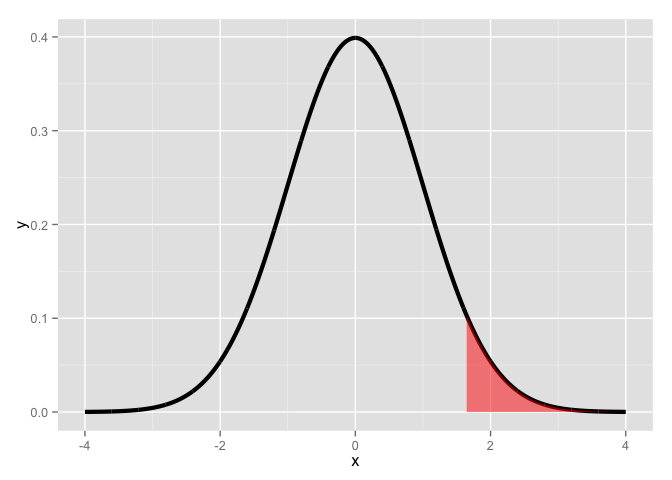
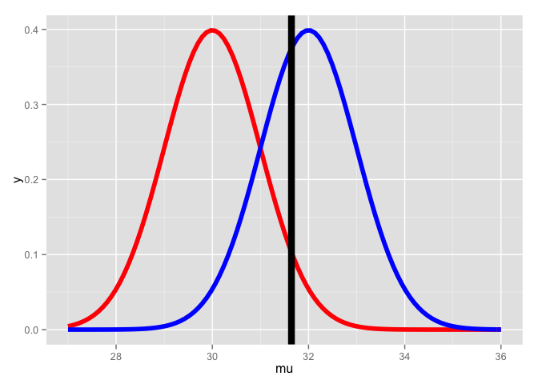
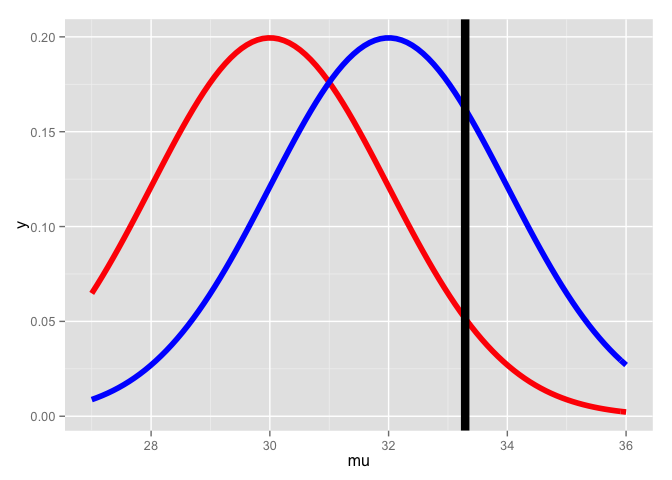
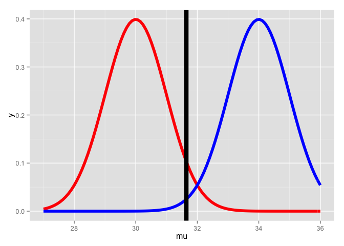
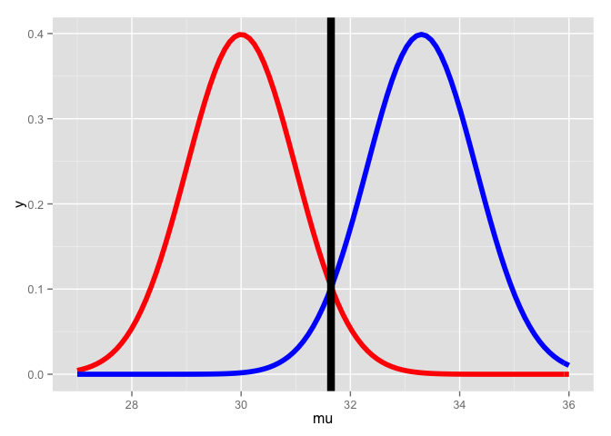
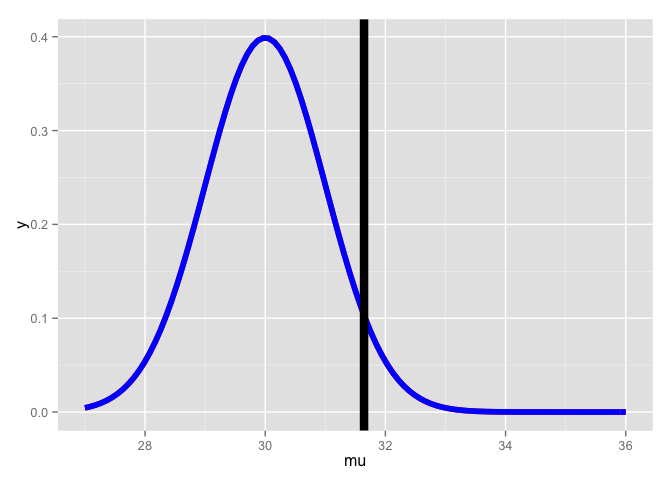
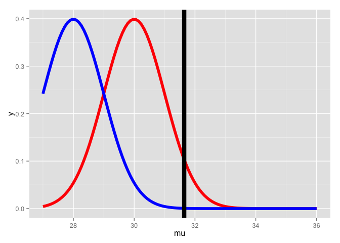
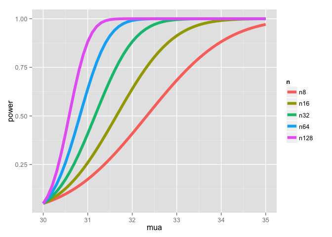
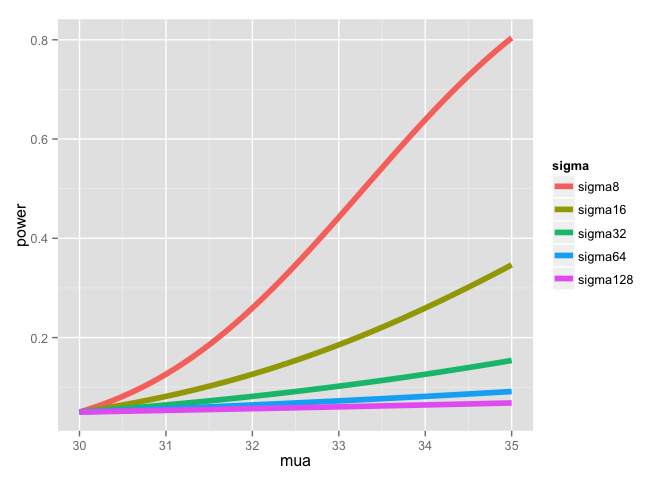
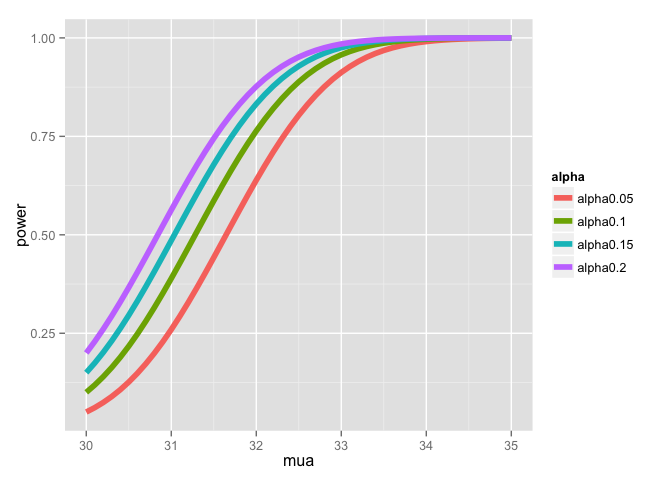

# Power

[Source](https://github.com/swirldev/swirl_courses/tree/master/Statistical_Inference/Power)


In this lesson, as the name suggests, we'll discuss POWER, which is the probability of rejecting the null hypothesis when it is false, which is good and proper.

Hence you want more POWER.

Power comes into play when you're designing an experiment, and in particular, if you're trying to determine if a null result (failing to reject a null hypothesis) is meaningful. For instance, you might have to determine if your sample size was big enough to yield a meaningful, rather than random, result.

Power gives you the opportunity to detect if your ALTERNATIVE hypothesis is true.

Do you recall the definition of a Type II error?  Remember, errors are bad.

```
Accepting a false null hypothesis
```

Beta is the probability of a Type II error, accepting a false null hypothesis; the complement of this is obviously (1 - beta) which represents the probability of rejecting a false null hypothesis. This is good and this is POWER!

Recall our previous example involving the Respiratory Distress Index and sleep disturbances. Our null hypothesis H_0 was that mu = 30 and our alternative hypothesis H_a was that mu > 30.

Which of the following expressions represents our test statistic under this null hypothesis? Here X' represents the sample mean, s is the sample std deviation, and n is the sample size. Assume X' follows a t distribution.

```
(X'-30)/(s/sqrt(n))
```

In the expression for the test statistic (X'-30)/(s/sqrt(n)) what does (s/sqrt(n)) represent?

```
a standard error
```

Suppose we're testing a null hypothesis H_0 with an alpha level of .05. Since H_a proposes that mu  > 30 (the mean hypothesized by H_0), power is the probability that the true mean mu is greater than the (1-alpha) quantile or qnorm(.95). For simplicity, assume we're working with normal distributions of which we know the variances.

Here's the picture we've used a lot in these lessons. As you know, the shaded portion represents 5% of the area under the curve. If a test statistic fell in this shaded portion we would reject H_0 because the sample mean is too far from the mean (center) of the distribution hypothesized by H_0. Instead we would favor H_a, that mu > 30. This happens with probability .05.

 

You might well ask, "What does this have to do with POWER?" Good question. We'll look at some pictures to show you.

First we have to emphasize a key point. The two hypotheses, H_0 and H_a, actually represent two distributions since they're talking about means or centers of distributions. H_0 says that the mean is mu_0 (30 in our example) and H_a says that the mean is mu_a.

We're assuming normality and equal variance, say sigma^2/n, for both hypotheses, so under H_0, X'~ N(mu_0, sigma^2/n) and under H_a, X'~ N(mu_a, sigma^2/n).

Here's a picture with the two distributions. We've drawn a vertical line at our favorite spot, at the 95th percentile of the red distribution. To the right of the line lies 5% of the red distribution.

 

Quick quiz! Which distribution represents H_0?

```
the red
```

Which distribution represents H_a?

```
the blue
```

From the picture, what is the mean proposed by H_a?

```
32
```

**See how much of the blue distribution lies to the right of that big vertical line? That, my friend, is POWER!**

It's the area under the blue curve (H_a) to the right of the vertical line.


Note that the placement of the vertical line depends on the null distribution. Here's another picture with fatter distributions. The vertical line is still at the 95th percentile of the null (red) distribution and 5% of the distribution still lies to its right. The line is calibrated to mu_0 and the variance.

 

Back to our original picture.

 

We've shamelessly stolen plotting code from the slides so you can see H_a in action. Let's look at pictures before we delve into numbers. We've fixed mu_0 at 30, sigma (standard deviation) at 4 and n (sample size) at 16. The function myplot just needs an alternative mean, mu_a, as argument. Run myplot now with an argument of 34 to see what it does.


```r
myplot(34)
```

 

The distribution represented by H_a moved to the right, so almost all (100%) of the blue curve is to the right of the vertical line, indicating that with mu_a=34, the test is more powerful, i.e., there's a higher probability that it's correct to reject the null hypothesis since it appears false. Now try myplot with an argument of 33.3.


```r
myplot(33.3)
```

 

This isn't as powerful as the test with mu_a=34 but it makes a pretty picture. Now try myplot with an argument of 30.


```r
myplot(30)
```

 

Uh Oh! Did the red curve disappear? No. it's just under the blue curve. The power now, the area under the blue curve to the right of the line, is exactly 5% or alpha!

So what did we learn?

First, power is a function that depends on a specific value of an alternative mean, mu_a, which is any value greater than mu_0, the mean hypothesized by H_0. (Recall that H_a specified mu>30.)

Second, if mu_a is much bigger than mu_0=30 then the power (probability) is bigger than if mu_a is close to 30. As mu_a approaches 30, the mean under H_0, the power approaches alpha.

Just for fun try myplot with an argument of 28.


```r
myplot(28)
```

 

We see that the blue curve has moved to the left of the red, so the area under it, to the right of the line, is less than the 5% under the red curve. This then is even less powerful and contradicts H_a so it's not worth looking at.

Here's a picture of the power curves for different sample sizes. Again, this uses code "borrowed" from the slides. The alternative means, the mu_a's, are plotted along the horizontal axis and power along the vertical.

 

What does the graph show us about mu_a?

```
as it gets bigger, it gets more powerful
```

What does the graph show us about sample size?

```
as it gets bigger, it gets more powerful
```

Now back to numbers. Our test for determining rejection of H_0 involved comparing a test statistic, namely Z=(X'-30)/(sigma/sqrt(n)), against some quantile, say Z_95, which depended on our level size alpha (.05 in this case). H_a proposed that mu > mu_0, so we tested if Z>Z_95. This is equivalent to X' > Z_95 * (sigma/sqrt(n)) + 30, right?

Recall that nifty R function pnorm, which gives us the probability that a value drawn from a normal distribution is greater or less than/equal to a specified quantile argument depending on the flag lower.tail. The function also takes a mean and standard deviation as arguments.

Suppose we call pnorm with the quantile 30 + Z_95 * (sigma/sqrt(n)) and specify mu_a as our mean argument. This would return a probability which we can interpret as POWER. Why?

Recall our picture of two distributions. 30 + Z_95 * (sigma/sqrt(n)) represents the point at which our vertical line falls. It's the point on the null distribution at the (1-alpha) level.

 

Study this picture. Calling pnorm with 30 + Z_95 * (sigma/sqrt(n)) as the quantile and mu_a, say 32, as the mean and lower.tail=FALSE does what?

```
returns the area under the blue curve to the right of the line
```

Let's try some examples now. Before we do, what do we know pnorm will return if we specify a quantile less than the mean?

(There are several red herrings in the choices. First pnorm will NEVER return a value greater than 1 because density functions by definition have areas equal to 1. We haven't specified an alpha or beta either. The function pnorm just needs a quantile, mean, and standard deviation. By default it looks at the lower tail of the distribution. That leaves one choice.)

```
an answer less than .50
```
First, define a variable z as qnorm(.95)

```
z <- qnorm(.95)
```

Run pnorm now with the quantile 30+z, mean=30, and lower.tail=FALSE. We've specified sigma and n so that the standard deviation of the sample mean is 1.


```r
pnorm(q = 30 + z, mean = 30, lower.tail = FALSE)
```

```
## [1] 0.05
```

That's not surprising, is it? With the mean set to mu_0 the two distributions, null and alternative, are the same and power=alpha. Now run pnorm now with the quantile 30+z, mean=32, and lower.tail=FALSE.


```r
pnorm(q = 30 + z, mean = 32, lower.tail = FALSE)
```

```
## [1] 0.63876
```

See how this is much more powerful? 64% as opposed to 5%. When the sample mean is quite different from (many standard errors greater than) the mean hypothesized by the null hypothesis, the probability of rejecting H_0 when it is false is much higher. That is power!

Let's look again at the portly distributions.

 

With this standard deviation=2 (fatter distribution) will power be greater or less than with the standard deviation=1?

(A greater standard deviation means more variability in the data so the test will be less powerful.)

```
less than
```

To see this, run pnorm now with the quantile 30+z, mean=32 and sd=1. Don't forget to set lower.tail=FALSE so you get the right tail.


```r
pnorm(q = 30 + z, mean = 32, sd = 1, lower.tail = FALSE)
```

```
## [1] 0.63876
```

Now run pnorm now with the quantile 30+z*2, mean=32 and sd=2. Don't forget to set lower.tail=FALSE so you get the right tail.


```r
pnorm(q = 30 + z * 2, mean = 32, sd = 2, lower.tail = FALSE)
```

```
## [1] 0.259511
```

See the power drain from 64% to 26% ? Let's review some basic facts about power. We saw before in our pictures that the power of the test depends on mu_a. When H_a specifies that mu > mu_0, then as mu_a grows and exceeds mu_0 increasingly, what happens to power?

```
it increases
```

Here's another question. Recall our power curves from before.

 

As the sample size increases, what happens to power?

```
it increases
```

Here's another one. More power curves.

 

As variance increases, what happens to power?

```
it decreases
```

Here's another one. And even more power curves.

 

As alpha increases, what happens to power?

```
it increases
```

If H_a proposed that mu != mu_0 we would calculate the one sided power using alpha / 2 in the direction of mu_a (either less than or greater than mu_0). (This is only approximately right, it excludes the probability of getting a large test statistic in the opposite direction of the truth.

Since power goes up as alpha gets larger would the power of a one-sided test be greater or less than the power of the associated two sided test?

(The quantity alpha is bigger than alpha/2 so it's got more power.)

```
greater
```

Finally, if H_a specified that mu < mu_0 could we still do the same kind of power calculations?

```
Yes
```

Suppose H_a says that mu > mu_0. Then power = 1 - beta = Prob ( X' > mu_0 + z_(1-alpha) * sigma/sqrt(n)) assuming that X'~ N(mu_a,sigma^2/n). Which quantities do we know in this statement, given the context of the problem? Let's work through this.

What does the null hypothesis H_0 tell us that the population mean equals?

```
mu_0
```

After the null mean mu_0 is proposed what does the designer of the hypothesis test specify in order to reject or fail-to-reject H_0? In other words, what is the level size of the test?

```
alpha
```

So we know that the quantities mu_0 and alpha are specified by the test designer. In the statement 1 - beta = Prob( X' > mu_0 + z_(1-alpha) * sigma/sqrt(n)) given mu_a > mu_0, mu_0 and alpha are specified, and X' depends on the data. The other four quantities, (beta, sigma, n, and mu_a), are all unknown.

It should be obvious that specifying any three of these unknowns will allow us to solve for the missing fourth. Usually, you only try to solve for power (1-beta) or the sample size n.

An interesting point is that power doesn't need mu_a, sigma and n individually.  Instead only sqrt(n)*(mu_a - mu_0) /sigma is needed. The quantity (mu_a - mu_0) / sigma is called the EFFECT SIZE. This is the difference in the means in standard deviation units. It is unit free so it can be interpreted in different settings.

We'll work through some examples of this now. However, instead of assuming that we're working with normal distributions let's work with t distributions. Remember, they're pretty close to normal with large enough sample sizes.

Power is still a probability, namely P( (X' - mu_0)/(S /sqrt(n)) > t_(1-alpha, n-1) given H_a that mu > mu_a ). Notice we use the t quantile instead of the z. Also, since the proposed distribution is not centered at mu_0, we have to use the non-central t distribution.

R comes to the rescue again with the function power.t.test. We can omit one of the arguments and the function solves for it. Let's first use it to solve for power.

We'll run it three times with the same values for n (16) and alpha (.05) but different delta and standard deviation values. We'll show that if delta (difference in means) divided by the standard deviation is the same, the power returned will also be the same. In other words, the effect size is constant for all three of our tests.

We'll specify a positive delta; this tells power.t.test that H_a proposes that mu > mu_0 and so we'll need a one-sided test. First run power.t.test(n = 16, delta = 2 / 4, sd=1, type = "one.sample", alt = "one.sided")$power .


```r
power.t.test(n = 16, delta = 2 / 4, sd = 1, type = "one.sample", alt = "one.sided")$power
```

```
## [1] 0.6040329
```

Now change delta to 2 and sd to 4. Keep everything else the same.


```r
power.t.test(n = 16, delta = 2, sd = 4, type = "one.sample", alt = "one.sided")$power
```

```
## [1] 0.6040329
```

Same answer, right? Now change delta to 100 and sd to 200. Keep everything else the same.


```r
power.t.test(n = 16, delta = 100, sd = 200, type = "one.sample", alt = "one.sided")$power
```

```
## [1] 0.6040329
```

So keeping the effect size (the ratio delta/sd) constant preserved the power. Let's try a similar experiment except now we'll specify a power we want and solve for the sample size n.

First run power.t.test(power = .8, delta = 2 / 4, sd = 1, type = "one.sample", alt = "one.sided")$n.


```r
power.t.test(power = .8, delta = 2 / 4, sd = 1, type = "one.sample", alt = "one.sided")$n
```

```
## [1] 26.13751
```

Now change delta to 2 and sd to 4. Keep everything else the same.


```r
power.t.test(power = .8, delta = 2, sd = 4, type = "one.sample", alt = "one.sided")$n
```

```
## [1] 26.13751
```

Same answer, right? Now change delta to 100 and sd to 200. Keep everything else the same.


```r
power.t.test(power = .8, delta = 100, sd = 200, type = "one.sample", alt = "one.sided")$n
```

```
## [1] 26.13751
```

Now use power.t.test to find delta for a power=.8 and n=26 and sd=1


```r
power.t.test(power = .8, n = 26, sd = 1, type = "one.sample", alt = "one.sided")$delta
```

```
## [1] 0.5013986
```

Not a surprising result, is it? It told you before that with an effect size of .5 and power .8, you need a sample size a little more than 26. Now run it with n=27.


```r
power.t.test(power = .8, n = 27, sd = 1, type = "one.sample", alt = "one.sided")$delta
```

```
## [1] 0.4914855
```

What do you think will happen if you doubled sd to 2 and ran the same test?

```
delta will double
```

Now for a quick review. We call this the power.u.test since it comes after the power.t.test. LOL.

The level of a test is specified by what?

```
alpha
```

What is a Type II error?

```
accepting a false hypothesis
```

What is power?

```
Power is 1-beta
```

You're a perfectionist designing an experiment and you want both alpha and beta to be small. Can they both be 0 for this single test?

```
No
```

Suppose H_0 proposes mu = mu_0 and H_a proposes that mu < mu_0. You'll test a series of mu_a with power != alpha. Which of the following is NOT true?

(As in the case in which H_a proposes that mu > mu_0, when mu_a=mu_0, alpha=power. This was excluded in the problem statement so mu_a=mu_0 cannot be true in this case.)

```
mu_a-mu_0=0
```

Suppose H_0 proposes mu = mu_0 and H_a proposes that mu < mu_0. Which of the following is true?

```
the smaller mu_a-mu_0 the more powerful the test
```

Which expression represents the size effect?

```
(mu_a - mu_0) / sigma
```

True or False? More power is better than less power.

```
True
```

True or False? A larger beta (call it beta_max) is more powerful than a smaller beta.

```
False
```

True or False? The larger the sample size the less powerful the test.

```
False
```

Congrats! You finished this powerful lesson. We hope you feel emPOWERED.
