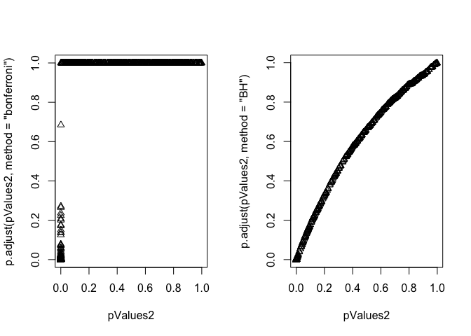

# Multiple Testing

[Source](https://github.com/swirldev/swirl_courses/tree/master/Statistical_Inference/Multiple_Testing)

Given that data is valuable and we'd like to get the most out of it, we might use it to test several hypotheses. If we have an alpha level of .05 and we test 20 hypotheses, then on average, we expect one error, just by chance.

Another potential problem is that after running several tests, only the lowest p-value might be reported OR all p-values under some threshold might be considered significant. Undoubtedly, some of these would be false.

Luckily, we have clever ways of minimizing errors in this situation. That's what we'll address. We'll define specific error measures and then statistical ways of correcting or limiting them.

Multiple testing is particularly relevant now in this age of BIG data. Statisticians are tasked with questions such as "Which variables matter among the thousands measured?" and "How do you relate unrelated information?"

Since multiple testing addresses compensating for errors let's review what we know about them. A Type I error is

```
rejecting a true hypothesis
```

In an American court, an example of a Type I error is

```
convicting an innocent person
```

A Type II error is

```
failing to reject a false hypothesis
```

In an American court, an example of a Type II error is

```
acquitting a guilty person
```

Good. Let's continue reviewing. The null hypothesis

```
represents the status_quo and is assumed true
```

The p-value is "the probability under the null hypothesis of obtaining evidence as or more extreme than your test statistic (obtained from your observed data) in the direction of the alternative hypothesis." Of course p-values are related to significance or alpha levels, which are set before the test is conducted (often at 0.05).

If a p-value is found to be less than alpha (say 0.05), then the test result is considered statistically significant, i.e., surprising and unusual, and the null hypothesis (the status quo) is ?

```
rejected
```

Now consider this chart copied from http://en.wikipedia.org/wiki/Familywise_error_rate. Suppose we've tested m null hypotheses, m_0 of which are actually true, and m-m_0 are actually false. Out of the m tests R have been declared significant, that is, the associated p-values were less than alpha, and m-R were nonsignificant, or boring results.


Looking at the chart, which variables are known?

```
m and R
```

In testing the m_0 true null hypotheses, V results were declared significant, that is, these tests favored the alternative hypothesis. What type of error does this represent?

```
Type I
```

Another name for a Type I error is False Positive, since it is falsely claiming a significant (positive) result.

Of the m-m_0 false null hypotheses, T were declared nonsignificant. This means that these T null hypotheses were accepted (failed to be rejected). What type of error does this represent?

```
Type II
```

Another name for a Type II error is False Negative, since it is falsely claiming a nonsignificant (negative) result.

A rose by any other name, right? Consider the fraction V/R. 

The observed R represents the number of test results declared significant. These are 'discoveries', something different from the status quo. V is the number of those falsely declared significant, so V/R is the ratio of FALSE discoveries. Since V is a random variable (i.e., unknown until we do an experiment) we call the expected value of the ratio, E(V/R), the False Discovery Rate (FDR).

A rose by any other name, right? How about the fraction V/m_0? From the chart, m_0 represents the number of true H_0's and m_0 is unknown. V is the number of those falsely declared significant, so V/m_0 is the ratio of FALSE positives. Since V is a random variable (i.e., unknown until we do an experiment) we call the expected value of the ratio, E(V/m_0), the FALSE POSITIVE rate.

Another good name for the false positive rate would be 

```
false alarm rate
```

The false positive rate would be closely related to

```
the Type I error rate
```

We call the probability of at least one false positive, Pr(V >= 1) the Family Wise Error Rate (FWER).

So how do we control the False Positive Rate?

Suppose we're really smart, calculate our p-values correctly, and declare   all tests with p < alpha as significant. This means that our false positive rate is at most alpha, on average.

Suppose we  perform 10,000 tests and alpha = .05. How many false positives do we expect on average?

```
500
```

You got it! 500 false positives seems like a lot. How do we avoid so many?

We can try to control the family-wise error rate (FWER), the probability of at least one false positive, with the Bonferroni correction, the oldest multiple testing correction.

It's very straightforward. We do m tests and want to control the FWER at level alpha so that Pr(V >= 1) < alpha. We simply reduce alpha dramatically. Set alpha_fwer to be alpha/m. We'll only call a test result significant if its p-value < alpha_fwer.

Sounds good, right? Easy to calculate. What would be a drawback with this method?

```
too many results will fail
```

Another way to limit the false positive rate is to control the false discovery rate (FDR). Recall this is E(V/R). This is the most popular correction when performing lots of tests. It's used in lots of areas such as genomics, imaging, astronomy, and other signal-processing disciplines.

Again, we'll do m tests but now we'll set the FDR, or E(V/R) at level alpha. We'll calculate the p-values as usual and order them from smallest to largest,  p_1, p_2,...p_m. We'll call significant any result with p_i <= (alpha*i)/m. This is the Benjamini-Hochberg method (BH). A p-value is compared to a value that depends on its ranking.

This is equivalent to finding the largest k such that p_k <= (k * alpha)/m, (for a given alpha) and then rejecting all the null hypotheses for i=1,...,k.

Like the Bonferroni correction, this is easy to calculate and it's much less conservative. It might let more false positives through and it may behave strangely if the tests aren't independent.

Now consider this chart copied from the slides. It shows the p-values for 10 tests performed at the alpha=.2 level and three cutoff lines. The p-values are shown in order from left to right along the x-axis. The red line is the threshold for No Corrections (p-values are compared to alpha=.2), the blue line is the Bonferroni threshold, alpha=.2/10 = .02, and the gray line shows the BH correction. Note that it is not horizontal but has a positive slope as we expect.


With no correction, how many results are declared significant?

```
4
```

With the Bonferroni correction, how many tests are declared significant?

```
2
```

So the Bonferroni passed only half the results that the No Correction (comparing p-values to alpha) method passed. Now look at the BH correction. How many tests are significant with this scale?

```
3
```

So the BH correction which limits the FWER is between the No Correction and the Bonferroni. It's more conservative (fewer significant results) than the No Correction but less conservative (more significant results) than the Bonferroni. Note that with this method the threshold is proportional to the ranking of the values so it slopes positively while the other two thresholds are flat.

Notice how both the Bonferroni and BH methods adjusted the threshold (alpha) level of rejecting the null hypotheses. Another equivalent corrective approach is to adjust the p-values, so they're not classical p-values anymore, but they can be compared directly to the original alpha. 

Suppose the p-values are p_1, ... , p_m.  With the Bonferroni method you would adjust these by setting p'_i = max(m  * p_i, 1)  for each p-value. Then if you call all p'_i < alpha significant you will control the FWER.

To demonstrate some of these concepts, we've created an array of p-values for you. It is 1000-long and the result of a linear regression performed on random normal x,y pairs so there is no true significant relationship between the x's and y's.


```r
set.seed(1010093)
pValues <- rep(NA,1000)
for(i in 1:1000){
  y <- rnorm(20)
  x <- rnorm(20)
  pValues[i] <- summary(lm(y ~ x))$coeff[2,4]
}
```

Use the R command head to see the first few entries of the array pValues.


```r
head(pValues)
```

```
## [1] 0.5334915 0.2765785 0.8380943 0.6721730 0.8122037 0.4078675
```

Now count the number of entries in the array that are less than the value .05. Use the R command sum, and the appropriate Boolean expression.


```r
sum(pValues < 0.05)
```

```
## [1] 51
```

So we got around 50 false positives, just as we expected (.05*1000=50). The beauty of R is that it provides a lot of built-in statistical functionality. The function p.adjust is one example. The first argument is the array of pValues. Another argument is the method of adjustment. Once again, use the R function sum and a boolean expression using p.adjust with method="bonferroni" to control the FWER.


```r
sum(p.adjust(pValues,method="bonferroni") < 0.05)
```

```
## [1] 0
```

So the correction eliminated all the false positives that had passed the uncorrected alpha test. Repeat the same experiment, this time using the method "BH" to control the FDR.


```r
sum(p.adjust(pValues,method="BH") < 0.05)
```

```
## [1] 0
```

So the BH method also eliminated all the false positives. Now we've generated another 1000-long array of p-values, this one called pValues2. In this data, the first half ( 500 x/y pairs) contains x and y values that are random and the second half contain x and y pairs that are related, so running a linear regression model on the 1000 pairs should find some significant  (not random) relationship.


```r
set.seed(1010093)
pValues2 <- rep(NA,1000)
for(i in 1:1000){
  x <- rnorm(20)
  # First 500 beta=0, last 500 beta=2
  if(i <= 500){y <- rnorm(20)}else{ y <- rnorm(20,mean=2*x)}
  pValues2[i] <- summary(lm(y ~ x))$coeff[2,4]
}
trueStatus <- rep(c("zero","not zero"),each=500)
```

We also created a 1000-long array of character strings, trueStatus. The first 500 entries are "zero" and the last are "not zero". Use the R function tail to look at the end of trueStatus.


```r
tail(trueStatus)
```

```
## [1] "not zero" "not zero" "not zero" "not zero" "not zero" "not zero"
```

Once again we can use R's greatness to count and tabulate for us. We can call the R function table with two arguments, a boolean such as pValues2<.05, and the array trueStatus. The boolean obviously has two outcomes and each entry of trueStatus has one of two possible values. The function table aligns the two arguments and counts how many of each combination (TRUE,"zero"), (TRUE,"not zero"), (FALSE,"zero"), and (FALSE,"not zero") appear. Try it now.


```r
table(pValues2 < 0.05, trueStatus)
```

```
##        trueStatus
##         not zero zero
##   FALSE        0  476
##   TRUE       500   24
```

We see that without any correction all 500 of the truly significant (nonrandom) tests were correctly identified in the "not zero" column. In the zero column (the truly random tests), however, 24 results were flagged as significant.

What is the percentage of false positives in this test?


```r
24/500
```

```
## [1] 0.048
```

Just as we expected - around 5% or .05*1000.

Now run the same table function, however, this time use the call to p.adjust with the "bonferroni" method in the boolean expression. This will control the FWER.


```r
table(p.adjust(pValues2,method="bonferroni") < 0.05, trueStatus)
```

```
##        trueStatus
##         not zero zero
##   FALSE       23  500
##   TRUE       477    0
```

Since the Bonferroni correction method is more conservative than just comparing p-values to alpha all the truly random tests are correctly identified in the zero column. In other words, we have no false positives. However, the threshold has been adjusted so much that 23 of the truly significant results have been misidentified in the not zero column.

Now run the same table function one final time. Use the call to p.adjust with "BH" method in the boolean expression. This will control the false discovery rate.


```r
table(p.adjust(pValues2,method="BH") < 0.05, trueStatus)
```

```
##        trueStatus
##         not zero zero
##   FALSE        0  487
##   TRUE       500   13
```

Again, the results are a compromise between the No Corrections and the Bonferroni. All the significant results were correctly identified in the "not zero" column but in the random ("zero") column 13 results were incorrectly identified. These are the false positives. This is roughly half the number of errors in the other two runs.

Here's a plot of the two sets of adjusted p-values, Bonferroni on the left and BH on the right. The x-axis indicates the original p-values. For the Bonferroni, (adjusting by multiplying by 1000, the number of tests), only a few of the adjusted values are below 1. For the BH, the adjusted values are slightly larger than the original values.


```r
plot.new()
par(mfrow=c(1,2))
plot(pValues2,p.adjust(pValues2,method="bonferroni"),pch=2)
plot(pValues2,p.adjust(pValues2,method="BH"),pch=2)
```

 

We'll conclude by saying that multiple testing is an entire subfield of statistical inference. Usually a basic Bonferroni/BH correction is good enough to eliminate false positives, but if there is strong dependence between tests there may be problems. Another correction method to consider is "BY".

Congrats! We hope you liked the multiple concepts and questions you saw in this lesson.
