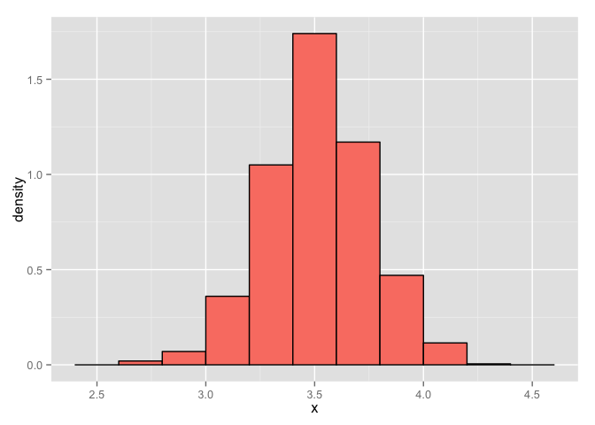
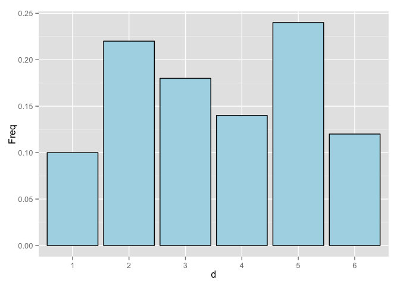
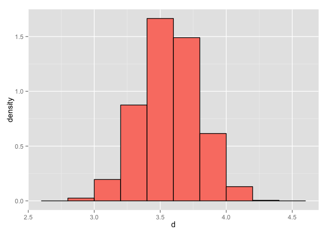
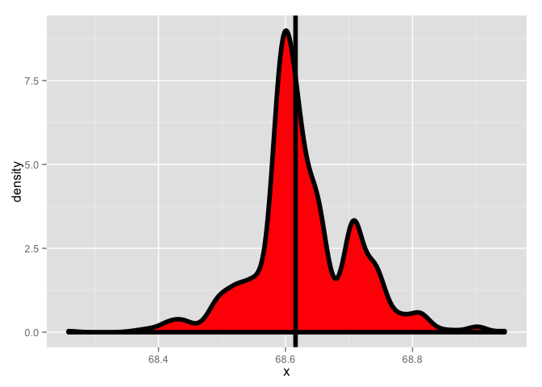
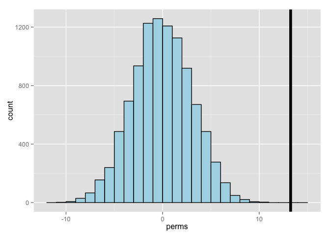
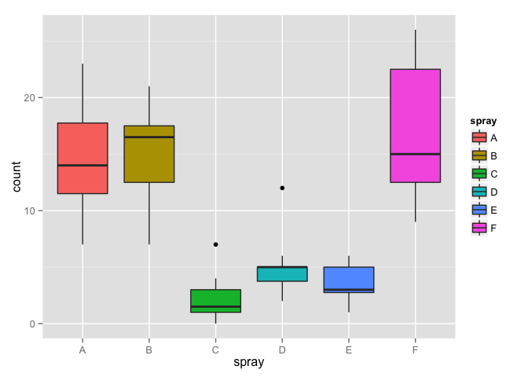

# Resampling

[Source](https://github.com/swirldev/swirl_courses/tree/master/Statistical_Inference/Resampling)


The bootstrap is a handy tool for making statistical inferences. It is used in constructing confidence intervals and calculating standard errors for statistics that might be difficult for some reason (e.g., lack of data or no closed form). Wikipedia tells us that bootstrapping is a technique which "allows estimation of the sampling distribution of almost any statistic using very simple methods."  Simple is good, right?

The beauty of bootstrapping is that it avoids complicated mathematics and instead uses  simulation and computation to infer distributional properties you might not otherwise be able to determine.

It's relatively new, developed in 1979, by Bradley Efron, a Stanford statistician. The basic bootstrap principle uses OBSERVED data to construct an ESTIMATED population distribution using random sampling with replacement. From this distribution (constructed from the observed data) we can estimate the distribution of the statistic we're interested in. 

So, in bootstrapping the observed data substitutes for what?

```
a population
```

So, in bootstrapping if the observed data is the population, what would the random samplings correspond to?

```
observations
```

In effect, the original observed sample substitutes for the population. Our samplings become observations from which we estimate a statistic and get an idea about its distribution. This lets us better understand the underlying population (from which we didn't have enough data).

Here's a critical point. In constructing the estimated distribution we sample the observed data WITH replacement. If the original sample is n long and we sampled n times without replacement what would we get?

```
the original sample permuted
```

The motivating example from the slides involves computing the average of 50 rolls of a die. Of course we can do this theoretically when we know that the die is fair. Remember, E(x) = Sum(x*p(x))  for x=1,2,...6, and p(x)=1/6 for all values of x.

For the heck of it, compute the expected die roll for a fair die.


```r
sum(rep(1/6, 6) * seq(1:6))
```

```
## [1] 3.5
```

Theoretically, the average is 3.5. Here, we've run code and plotted a histogram after we took 1000 such averages, each of 50 dice rolls. Note the unusual y-axis scale. We're displaying this as a density function so the area of the salmon-colored region is theoretically 1. With this scale, though, all the heights of the bins actually add up to 5. So  you have multiply each height  by .2 and add up all the results to get 1. 

 

The point is, the empirical matches the theoretical. Yay! The highest bin is centered at 3.5 just as the math predicted. So what?

What if some joker wanted you to run the same experiment with a die he gave you and he warned you that the dice was loaded? In other words, it wasn't fair. It has some random distribution like this.

 

The outcomes aren't equally likely, are they? So when you do your 1000 runs of 50 rolls each, the density of the means looks different. 

We've done this for you and put the result in g2. Type print(g2) now to see the picture.


```r
print(g2)
```

 

Picture's a little different, right? Although this example is a bit contrived, it illustrates an important concept. We really want a distribution of  means and we  have only one set of observations. (In this case it was the empirical distribution associated with the unfair die - the big blue picture.) We used that one distribution, to "create" many (1000) distributions by sampling with replacement from the given one. We sampled 50000 times so we created 1000 distributions of 50 rolls each.

We then calculated the mean of each of our created distributions and got a distribution of means. Sampling the one distribution many times gives us some variability in the resulting statistics we calculate. We can then calculate the  standard error  and confidence intervals associated with the statistic.

Before we go on to more theory, here's another example in which we'll try to find a distribution of medians of a population. Do you recall what a median is?

```
50th percentile
```

Recall the father and son height data. Once again, we've loaded it for you. We've placed the height of the sons  in the vector sh and the length of this vector is stored in the variable nh. Use the R command head to look at the first few entries of sh.


```r
head(sh)
```

```
## [1] 59.77827 63.21404 63.34242 62.79238 64.28113 64.24221
```

Now look at nh to see how long sh is.


```r
nh
```

```
## [1] 1078
```

Now we'll create 1000 distributions of the same length as the original sh. We'll do this by sampling sh with replacement  1000*nh times and store the results in an array with 1000 rows, each with nh entries. Then we'll take the median of each row and plot the result. 

Note that every time we draw from the empirical distribution sh, each of its nh data points is equally likely to be pulled, therefore the probability of drawing any one is 1/nh. The 1000 samples we create will vary from the original.

Here's the resulting density curve. This estimates the distribution of  medians. The thick vertical line shows where the  median of the original, observed data sh lies.

 

We stored the 1000  medians of the resampled sets in the vector resampledMedians. Use the R function median to compute the median of numbers in this vector.


```r
median(resampledMedians)
```

```
## [1] 68.61582
```

Now compute the median of the original sample sh.


```r
median(sh)
```

```
## [1] 68.61582
```

Class: text
  Output: Pretty close, right? Now back to theory. Suppose you have a statistic that estimates some population parameter, but you don't know its sampling distribution. The bootstrap principle uses the distribution defined by the observed data to approximate the sampling distribution of that statistic.

The nice thing about bootstrapping is that you can always do it with simulation. The general procedure follows by first simulating B complete data sets from the observed data by sampling with replacement. Make sure B is large and that you're sampling WITH replacement to create data sets the same size as the original.

This approximates drawing from the sampling distribution of that statistic, at least as well as the data approximates the true population distribution. By calculating the statistic for each simulated data set and using these simulated statistics we can either define a confidence interval (e.g. find the 2.5 and the 97.5 percentiles) or take the standard deviation to estimate a standard error of that statistic.

Notice that this process doesn't use any fancy math or asymptotics. The only assumption behind it is that the observed sample is representative of the underlying population.

We've created the vector fh for you which contains the fathers' heights from the father son data we've been working with. It's the same length as the sons' data (1078) which is stored in nh. B, the number of bootstraps we want has been set to 1000. We'll do an example now in small steps.

Our one sample of observed data is in the vector fh. Use the R function sample to sample fh nh*B times. Set the argument replace to TRUE. Put the result in the variable sam.


```r
sam <- sample(fh, nh * B, replace = TRUE)
```

Now form sam into a matrix with B rows and nh columns. Use the R function matrix and put the result in resam


```r
resam <- matrix(sam, B, nh)
```

Now use the R function apply to take the median (third argument) of each row of resam (first argument). Put the result in meds. The second argument, the number 1, specifies that the application of the function is to the rows of the first argument.


```r
meds <- apply(resam, 1, median)
```

Now look at the difference between the median of fh and the median of meds.


```r
median(meds) - median(fh)
```

```
## [1] -0.00052
```

Pretty close, right? Now use the R function sd to estimate the standard error of the vector meds.


```r
sd(meds)
```

```
## [1] 0.1031946
```

We previously did this same process for the sons' data and stored the resampled medians in the 1000-long vector resampledMedians. Find the standard error of resampledMedians. 


```r
sd(resampledMedians)
```

```
## [1] 0.08067691
```

Now we'll find a 95% confidence interval for the sons' data with the R function quantile. The first argument is the vector of resampledMedians and the second is the expression c(.025,.975). Do this now. 


```r
quantile(resampledMedians, c(.025, .975))
```

```
##     2.5%    97.5% 
## 68.46248 68.80709
```
Pretty close quantiles, right? Now do the same thing for the fathers' data. Recall that it's stored in the vector meds. 


```r
quantile(meds, c(.025, .975))
```

```
##     2.5%    97.5% 
## 67.55184 67.94357
```

Another pair of close quantiles, but notice that these quantiles of the fathers' medians differ from those of the sons.

Bootstrapping is a very diverse and complicated topic and we just skimmed the surface here. The technique we showed you is nonparametric, that is, it's not based on any parameterized family of probability distributions. We  used only one set of observations that we assumed to be representative of the population. 

Finally, the confidence intervals we calculated might not perform very well because of biases but the  R package bootstrap provides an easy fix for this problem.

Now, to permutation testing, another handy tool used in group comparisons. As bootstrapping did, permutation testing samples a single dataset a zillion times and calculates a statistic based on these samplings. 

Permutation testing, however, is based on the idea of exchangability of group labels. It measures whether or not outcomes are independent of group identity. Our zillion samples simply permute group labels associated with outcomes. We'll see an example of this.

Here's a picture from the dataset InsectSprays which contains counts of the number of bugs killed by  six different sprays. 

 

We'll use permutation testing to compare Spray B with Spray C.

Use the R command dim to find the dimensions of InsectSprays.


```r
dim(InsectSprays)
```

```
## [1] 72  2
```

Now use the R command names to find what the two columns of InsectSprays contain.


```r
names(InsectSprays)
```

```
## [1] "count" "spray"
```

We'll use permutation testing to compare Spray B with Spray C. We subsetted  data for these two sprays into a data frame subdata. Moreover, the two data frames Bdata and Cdata contain the data for their respective sprays. 

Now use the R command range on Bdata$count to find the minimum and maximum counts for Spray B.


```r
range(Bdata$count)
```

```
## [1]  7 21
```

The picture makes more sense now, right? Now do the same for Spray C. Its data  is in Cdata.


```r
range(Cdata$count)
```

```
## [1] 0 7
```

From the ranges (as well as the picture), the sprays look a lot different. We'll test the (obviously false) null hypothesis that their means are the same. 

To make the analysis easier we've defined two arrays for you, one holding the counts for sprays B and C. It's call BCcounts. Look at it now.


```r
BCcounts
```

```
##  [1] 11 17 21 11 16 14 17 17 19 21  7 13  0  1  7  2  3  1  2  1  3  0  1
## [24]  4
```

The second array we've defined holds the spray identification and it's called group. These two arrays line up with each other, that is, the first 12 entries of counts are associated with spray B and the last 12 with spray C. Look at group now.


```r
group
```

```
##  [1] "B" "B" "B" "B" "B" "B" "B" "B" "B" "B" "B" "B" "C" "C" "C" "C" "C"
## [18] "C" "C" "C" "C" "C" "C" "C"
```

We've also defined for you a one-line function testStat which takes two parameters, an array of counts and an array of associated identifiers. It assumes all the counts come from group B or group C. It subtracts the mean of the counts from group C from the mean of the counts of group B. Type testStat with no parentheses and no arguments to see how it's defined. 


```r
testStat
```

```
## function(w, g) mean(w[g == "B"]) - mean(w[g == "C"])
```

Now set a variable obs by invoking testStat with the arguments BCcounts and group and assigning the result to obs.


```r
obs <- testStat(BCcounts, group)
```

Take a peek at obs now.


```r
obs
```

```
## [1] 13.25
```

Pretty big difference, right? You can check this by using mean on Bdata$count and on Cdata$count and subtracting the latter from the former. Equivalently, you can just apply mean to Bdata$count-Cdata$count. Do either one now.


```r
mean(Bdata$count) - mean(Cdata$count)
```

```
## [1] 13.25
```

So, mean(Bdata$count)-mean(Cdata$count) equals mean(Bdata$count-Cdata$count) because ?

```
mean is linear
```

Now this is where the permutation testing starts to involve resampling. We're going to test whether or not the particular group association of the counts affects the difference of the means. 

We'll keep the same array of counts, just randomly relabel them, by permuting the group array. R makes this process very easy. Calling the function sample (which we've used several times in this lesson) with one argument, an array name, will simply permute the elements of that array.

Call sample now on the array group to see what happens.


```r
sample(group)
```

```
##  [1] "B" "C" "B" "B" "C" "C" "C" "B" "C" "C" "B" "B" "C" "B" "B" "B" "C"
## [18] "C" "C" "C" "B" "B" "B" "C"
```

The labels are all mixed up now. We'll do this permuting of labels and then we'll recalculate the difference of the means of the two "new" (really newly labelled) groups.

We'll relabel and calculate the difference of means 10000 times and store the differences (of means) in the array perms. Here's what the code looks like `perms <- sapply(1 : 10000, function(i) testStat(BCcounts, sample(group)))`. Try it now.


```r
perms <- sapply(1 : 10000, function(i) testStat(BCcounts, sample(group)))
```

We can take the mean of the virtual array of the boolean expression perms > obs. Do this now.


```r
mean(perms > obs)
```

```
## [1] 0
```

So on average 0 of the permutations had a difference greater than the observed. That means we would reject the null hypothesis that the means of the two sprays were equal.

Here's a histogram of the difference of the means. Looks pretty normal, right? We can see that the distribution runs roughly between -10 and +10 and it's centered around 0. The vertical line shows where the observed difference of means was and we see that it's pretty far away from the distribution of the resampled permutations. This means that group identification did matter and sprays B and C were quite different.

 

Here's the picture of the InsectSprays again. Suppose we run the same experiment, this time comparing sprays D and E, which look more alike. We've redefined testStat to look at these sprays and subtract the mean of spray E from the mean of spray D. 

 

We've also stored off the D and E data in DEcounts and the group labels in group. Run testStat now with DEcounts and group.


```r
testStat(DEcounts, group)
```

```
## [1] 1.416667
```

We've  stored off this value, 1.416667, in the variable obs for you. Now run the permutation command, with DEcounts. Here it is, `perms <- sapply(1 : 10000, function(i) testStat(DEcounts, sample(group)))`


```r
perms <- sapply(1 : 10000, function(i) testStat(DEcounts, sample(group)))
```

Finally, we can plot the histogram of the distribution of the difference of the means. We see that with these sprays the observed difference of means (the vertical line) is closer to the mean of the permuted labels. This indicates that sprays D and E are quite similar and we fail to reject the null hypothesis that the means were equal.

 
